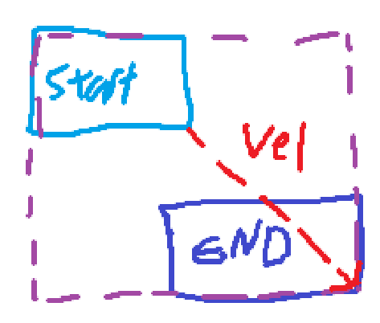
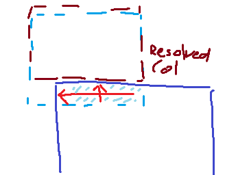
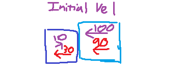

# Simple Collision Engine
Basic collision detection with AABB for GFS Academy 1 Assignment

## Controls
WASD - Move Camera
Scroll Wheel - Zoom In/Out
Space - Pause Simulation
Left Click - Select Block To View Debug Info
Right Click - Spawn New Block

## Building
Run provided batch files for each platform (Windows & Linux supported)

## Algorithms
### Broad Stage Check
Currently the broad stage collision detection checks each moving body to the physics world by creating a larger AABB rectangle that encompases the base rect and final position after applying velocity.  A better implementation in the future would be to change this to use a quad tree alongside this so we do not loop through the whole scene.  Each individual check is just a single AABB overlap test.  If there is any overlap then it gets added to an array and sent to the narrow stage.  Note that while most bodies do their broad stage check every frame, any bodies that are static are skipped over.  Sleeping bodies was an incomplete feature but would allow for non-static objects to be skipped over when needed too.

### Narrow Stage Check
The narrow stage check loops through all bodies found in the broad stage and does overlap tests now with the precise AABB collider.  To ensure acuracy and prevent objects with a high enough collision from going through the floor, the narrow stage ultimately does several overlap tests from the starting position to the final position (the starting position with the velocity for the frame added).  The first result from here is then chosen and the data from it is sent to be resolved.

### Resolving Collisions
The collision from the narrow stage is resolved by firstly finding which axis of the AABB penetrates the most into the colliding object.  When this is determined there is a check to see if the colliding object is static as this will effect the applied velocity.  If it is static, the moving object goes to the position of the collision but gets pushed away from the resulting axis with the depth of the collision.  If the secondary object is not static then both objects get pushed away equally.  

Then a force is applied to both objects to push them away.  This takes into account the magnitude of their velocity in the direction of impact as well as the bounciness factor stored in the physics body.  This lets bouncier objects bounce more on impact, or objects with a strong forward velocity not completely stop when running into a smaller object.  This is also how collisions with the floor get resolved as objects will not pass through 

